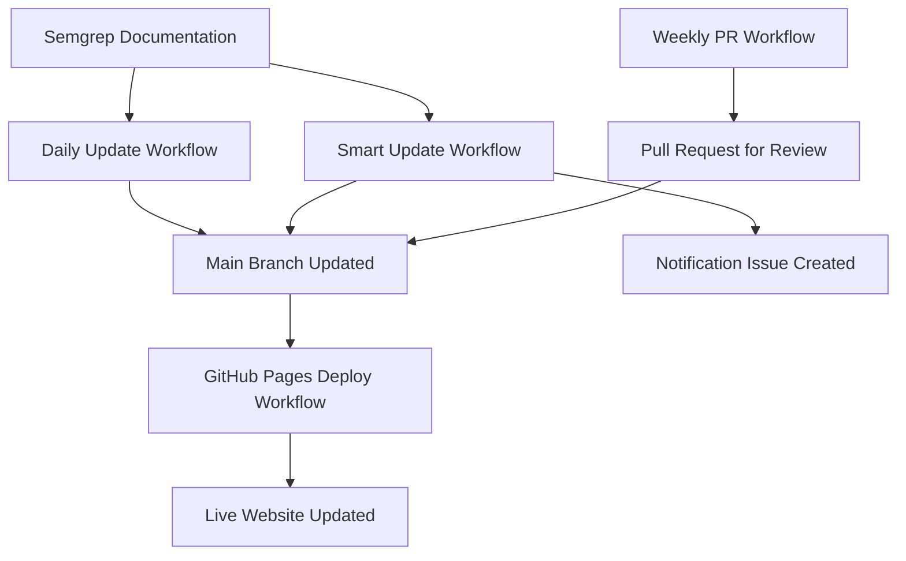

# 🚀 Complete Feature Matrix Automation System

This directory contains a **comprehensive automation system** that keeps your Feature Matrix Generator always up-to-date and notifies you of important changes. All workflows work together seamlessly to provide a hands-off experience.

## 🏗️ System Architecture



## 🤖 Active Workflows

### 1. **Daily Updates** (`update-data.yml`) 
**🔄 Scheduled: Daily at 6 AM UTC**

**What it does:**
- Fetches latest data from Semgrep documentation
- Updates `languages.json` and `scms.json` automatically
- Commits directly to main branch
- Triggers GitHub Pages deployment automatically

**Perfect for:** Keeping data fresh without any manual intervention

---

### 2. **GitHub Pages Auto-Deploy** (`deploy-to-gh-pages.yml`)
**🚀 Triggered: When main branch gets data updates**

**What it does:**
- Detects when JSON data files are updated on main branch  
- Automatically merges changes to `github-pages` branch
- Deploys updated data to your live website
- Provides deployment status and summaries

**Perfect for:** Instant live updates after data changes

---

### 3. **Smart Updates with Notifications** (`smart-update.yml`)
**🧠 Scheduled: Twice daily (8 AM & 8 PM UTC)**

**What it does:**
- Analyzes changes for significance (new languages, major Pro rules increases)
- Creates GitHub Issues for important updates that need attention
- Provides detailed change analysis and action items
- Includes links to updated data and deployment status

**Perfect for:** Getting notified when Semgrep adds major new capabilities

---

### 4. **Weekly Pull Requests** (`weekly-update-pr.yml`)
**📋 Scheduled: Mondays at 9 AM UTC**

**What it does:**
- Creates pull requests for data updates instead of direct commits
- Allows team review before changes go live
- Detailed PR descriptions with change summaries

**Perfect for:** Teams that want review control over updates

## ⚡ How They Work Together

### Normal Operation Flow:
1. **Daily Update** runs and finds new data → commits to main
2. **GitHub Pages Deploy** automatically triggered → live site updated in 2-3 minutes
3. **Smart Update** (if it runs) detects significant changes → creates notification issue

### Significant Change Flow:
1. **Smart Update** detects major changes (new language, big Pro rules increase)
2. **Notification Issue** created with detailed analysis and action items
3. **GitHub Pages Deploy** still auto-triggers → live site stays current
4. **You get notified** to review and take action

## 🔧 Configuration & Setup

### Required Repository Permissions
1. **Settings** → **Actions** → **General**
2. **Workflow permissions**: ✅ **Read and write permissions**
3. **Pull requests**: ✅ **Allow GitHub Actions to create and approve pull requests**

### Customizing Schedules

Edit any workflow's `cron` schedule:

```yaml
schedule:
  - cron: '0 6 * * *'    # Daily at 6 AM UTC
  - cron: '0 8,20 * * *'  # Twice daily at 8 AM & 8 PM UTC  
  - cron: '0 9 * * 1'    # Weekly on Monday at 9 AM UTC
```

**Time Zone Converter:**
- `0 6 * * *` = 6 AM UTC (1 AM EST, 10 PM PST)
- `0 14 * * *` = 2 PM UTC (9 AM EST, 6 AM PST)
- `0 20 * * *` = 8 PM UTC (3 PM EST, 12 PM PST)

### Notification Thresholds

**Smart Update triggers notifications for:**
- 🆕 **New languages** added to Semgrep
- 📈 **Pro rules increases** of 100+ rules OR 50%+ increase
- 🔄 **SCM feature changes** (new integration capabilities)

## 📊 Monitoring Your System

### GitHub Actions Dashboard
- **Actions** tab → View all workflow runs
- **Color coding**: Green = success, Red = failure, Yellow = in progress

### Workflow Status Badges
Add to your README:

```markdown


```

### Notification Management
- **Issues** tab → Filter by `automated` label for notifications
- **Notifications** settings → Enable Actions notifications for failures

## 🛟 Troubleshooting

### Common Issues & Solutions

**❌ "Permission denied" errors**
```bash
# Solution: Check repository permissions (see Configuration section)
```

**❌ GitHub Pages not updating**
```bash
# Check: Settings → Pages → Source should be "Deploy from a branch: github-pages"
# Verify: Actions tab shows "Deploy to GitHub Pages" workflow succeeded
```

**❌ No changes detected but expecting updates**
```bash
# Debug: Run workflow manually first
# Check: Actions logs for HTTP errors or connection issues  
# Verify: Semgrep documentation URLs are accessible
```

**❌ Notification issues not being created**
```bash
# Check: Issues permission enabled in repository settings
# Verify: Smart update workflow detected "significant=true" changes
```

### Manual Testing

Test any workflow manually:
1. **Actions** tab → Select workflow
2. **Run workflow** → Choose branch
3. **Run workflow** button

### Debug Mode

Add to any workflow for verbose logging:
```yaml
env:
  ACTIONS_RUNNER_DEBUG: true
  ACTIONS_STEP_DEBUG: true
```

## 🔐 Security & Best Practices

✅ **Security Features:**
- Only updates JSON data files (no code execution)
- Uses official GitHub Actions with pinned versions
- No secrets or sensitive data exposed
- Runs in isolated GitHub-hosted environments
- All changes are tracked in git history

✅ **Best Practices:**
- Workflows only commit to designated branches
- Clear commit messages with change descriptions
- Comprehensive logging and status reporting
- Graceful handling of merge conflicts
- Automatic cleanup of temporary files

## 🎯 Expected Benefits

### Before Automation:
- ❌ Manual script runs required
- ❌ GitHub Pages manually updated
- ❌ No notification of important changes
- ❌ Risk of stale presentation data

### After Automation:
- ✅ **Always fresh data** (max 24 hours old)
- ✅ **Live site auto-updates** (2-3 minutes after data changes)
- ✅ **Proactive notifications** for major changes
- ✅ **Zero maintenance** required
- ✅ **Presentation-ready** anytime

## 🚀 Getting Started

1. **Choose your workflows** based on your needs:
   - **Minimum**: `update-data.yml` + `deploy-to-gh-pages.yml`
   - **Recommended**: All 4 workflows for complete automation
   - **Team environments**: Include `weekly-update-pr.yml` for review control

2. **Set repository permissions** (see Configuration section)

3. **Test manually** before relying on automation:
   ```bash
   # Actions tab → "Update Feature Matrix Data" → "Run workflow"
   ```

4. **Monitor first few runs** to ensure everything works smoothly

5. **Customize schedules** if needed for your timezone/workflow

## 📈 Success Metrics

Track your automation success:
- ✅ **Zero stale data incidents** in presentations
- ✅ **Proactive change awareness** before customer meetings
- ✅ **Reduced manual maintenance** time
- ✅ **Always current** competitive intelligence

---

*🎉 Your Feature Matrix Generator is now fully automated! Focus on winning deals while the system keeps your data fresh.* 🚀 